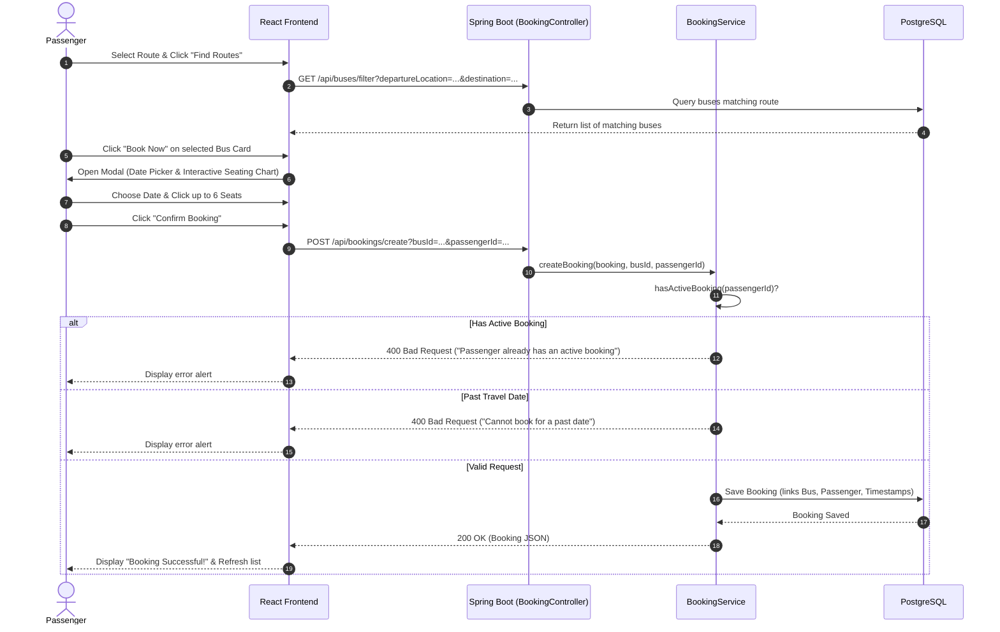
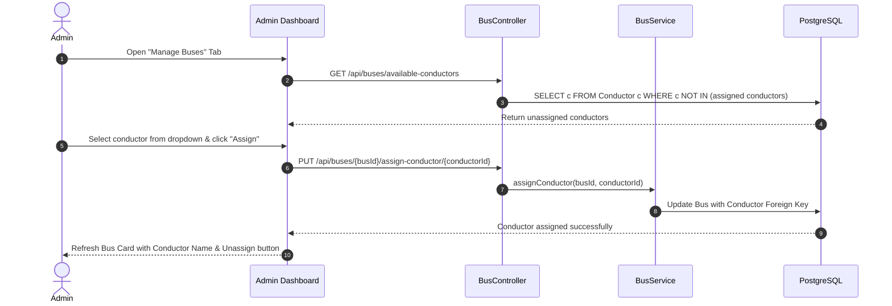

# 🛠️ Bus Booking System — Functional Specifications Report

This report provides an in-depth, comprehensive catalog of all features, functional capabilities, business rules, API endpoints, and system workflows implemented in the **Bus Booking System**.

---

## 📑 Table of Contents
1. [Executive Summary](#1-executive-summary)
2. [Functional Modules Overview](#2-functional-modules-overview)
3. [Role-Based Functions](#3-role-based-functions)
   - [3.1 Passenger Functions](#31-passenger-functions)
   - [3.2 Conductor Functions](#32-conductor-functions)
   - [3.3 Administrator Functions](#33-administrator-functions)
4. [End-to-End System Workflows](#4-end-to-end-system-workflows)
5. [Business Logic & Validation Rules](#5-business-logic--validation-rules)
6. [Complete REST API Functional Reference](#6-complete-rest-api-functional-reference)
7. [Frontend Service Function Mapping](#7-frontend-service-function-mapping)
8. [Database Schema & Data Integrity](#8-database-schema--data-integrity)

---

## 1. Executive Summary

The **Bus Booking System** is an end-to-end transportation reservation and fleet management system built to automate bus ticket booking, schedule management, and passenger manifest monitoring. It eliminates manual booking errors, enforces business rules (such as single-active-booking constraints and seat limits), and provides synchronized real-time visibility across passengers, bus conductors, and administrators.

---

## 2. Functional Modules Overview

```
+-----------------------------------------------------------------------------------+
|                            BUS BOOKING SYSTEM MODULES                             |
+-----------------------------------------------------------------------------------+
|  1. AUTHENTICATION & ACCESS CONTROL                                               |
|     - Passenger Self-Registration                                                 |
|     - Multi-Role Login (Passenger, Conductor, Admin)                              |
|     - Session & State Management via LocalStorage                                 |
+-----------------------------------------------------------------------------------+
|  2. FLEET & ROUTE MANAGEMENT                                                      |
|     - Bus Creation, Editing, Deletion                                             |
|     - Daily Schedule & Departure/Arrival Time Management                          |
|     - Conductor Assignment & Dynamic Unassignment                                 |
|     - Route Filtering by Origin and Destination                                   |
+-----------------------------------------------------------------------------------+
|  3. SEAT RESERVATION & BOOKING ENGINE                                             |
|     - Visual 50-Seat Bus Layout Component                                         |
|     - Multi-Seat Interactive Selection (1 to 6 seats limit)                       |
|     - Travel Date Selection (Past Date Lockout)                                   |
|     - Active Booking Collision Detection                                          |
|     - Automated Timestamps (Booking, Request Date & Time)                         |
|     - Real-time Ticket Cancellation                                               |
|     - Booking Expiration Tracker                                                  |
+-----------------------------------------------------------------------------------+
|  4. TRIP & MANIFEST MONITORING                                                    |
|     - Conductor Trip Passenger Manifest                                           |
|     - Passenger Contact & Reservation Count Verification                          |
+-----------------------------------------------------------------------------------+
|  5. USER ADMINISTRATION                                                           |
|     - Conductor Recruitment / Hiring & Deletion                                   |
|     - Passenger Account Auditing & Deletion                                       |
|     - Search Conductors & Passengers by Username (Case-Insensitive)               |
|     - Automated Super Admin Seeding on Startup                                    |
+-----------------------------------------------------------------------------------+
```

---

## 3. Role-Based Functions

### 3.1 Passenger Functions

The passenger portal provides a self-service ticket booking experience:

| Feature / Function | Description | Implementation Details |
| :--- | :--- | :--- |
| **Account Registration** | Allows new travelers to create an account by providing username, password, phone number, and residential address. | Validates phone number to exactly 10 digits via regex. Enforces unique username. |
| **Authentication / Login** | Passengers log in using their username and password under the `PASSENGER` role. | Session details stored in `localStorage` with `passengerId` and user metadata. |
| **Route Filtering & Bus Search** | Allows passengers to search buses by selecting origin and destination cities from predefined locations (Colombo, Kandy, Galle, Matara, Jaffna, Trincomalee, Kurunegala, Anuradhapura). | Calls `GET /api/buses/filter` with `departureLocation` and `destination` query parameters. |
| **Bus Fleet Browsing** | Passengers can view all scheduled buses displaying route information, departure times, arrival times, and total seat capacity. | Handled by `BusCard.jsx` displaying departure/destination with formatted 12-hour AM/PM times. |
| **Interactive Seat Picker** | Visual representation of a 50-seat bus layout (`BookingCard.jsx`) with left aisle (2 seats), right aisle (2 seats), and rear seats. | Seats toggle between unselected and selected states. Enforces a maximum cap of 6 seats per booking. |
| **Date-Based Booking** | Travelers select their intended travel date using an HTML5 date input with past-date lockout. | Disallows dates prior to `LocalDate.now()`. |
| **Active Booking Lockout** | Prevents double-booking. A passenger who already has an ongoing or future unexpired trip cannot place another booking until the existing one is completed or cancelled. | Evaluated in `BookingService.hasActiveBooking()`. Checks travel date and arrival time against `LocalTime.now()`. |
| **Booking History Review** | A dedicated "My Bookings" tab displays all current and past reservations placed by the passenger. | Displays Booking ID, Travel Date, Bus Route, Scheduled Times, and Total Seats. |
| **Booking Expiry Tracking** | Detects whether a booking has already passed its scheduled travel date and arrival time, applying an `(EXPIRED)` badge and dimming the card. | Real-time frontend check comparing booking date/time with the user's current clock. |
| **Booking Cancellation** | Allows passengers to cancel unexpired bookings directly from their dashboard with instant database removal. | Issues `DELETE /api/bookings/cancel/{id}`. Deletes record and updates remaining bookings. |

---

### 3.2 Conductor Functions

The conductor portal simplifies trip supervision and boarding operations:

| Feature / Function | Description | Implementation Details |
| :--- | :--- | :--- |
| **Conductor Authentication** | Dedicated login for bus conductors under the `CONDUCTOR` role. | Validates credentials via `POST /api/conductors/login`. |
| **Assigned Bus Resolution** | Automatically identifies which bus the logged-in conductor is assigned to operate. | Queries the 1-to-1 relationship between `Conductor` and `Bus`. |
| **Real-Time Passenger Manifest** | Displays a clean, tabular passenger manifest for the assigned bus. | Lists passenger username, contact phone number, number of reserved seats, and reservation location ("Online"). |
| **Empty State Handling** | Notifies the conductor when no bookings have been placed yet or if no bus has been currently assigned by the administrator. | Prevents crashes by validating `currentUser.conductorId` before fetching data. |

---

### 3.3 Administrator Functions

The admin portal provides complete operational control over buses, crew, and passengers:

#### A. Bus Fleet Operations
| Function | Description | Implementation Details |
| :--- | :--- | :--- |
| **Add New Bus** | Register a new bus route with departure city, destination, departure time (`HH:mm`), arrival time (`HH:mm`), total seat capacity, and descriptive notes. | `POST /api/buses/add`. Daily time values stored as `LocalTime`. |
| **Update Bus Details** | Modify existing bus itineraries, schedule timings, capacity, or descriptions. | Populates form with existing values; updates via `PUT /api/buses/update/{id}`. |
| **Delete Bus** | Permanently remove a decommissioned or cancelled bus from the fleet. | `DELETE /api/buses/delete/{id}`. |
| **Conductor Assignment** | Assign an available conductor to a specific bus from a dynamic dropdown list. | `PUT /api/buses/{busId}/assign-conductor/{conductorId}`. |
| **Conductor Unassignment** | Detach a conductor from a bus with a single click, returning them to the pool of available conductors. | `PUT /api/buses/{busId}/unassign-conductor`. |
| **Available Conductor Query** | Dynamically filters out conductors who are already actively assigned to another bus. | Uses custom JPQL query in `ConductorRepository.findAvailableConductors()`. |

#### B. Conductor Workforce Operations
| Function | Description | Implementation Details |
| :--- | :--- | :--- |
| **Hire / Add Conductor** | Create new conductor user credentials (username, password, 10-digit phone number, address). | `POST /api/conductors/add`. |
| **List Conductors** | View all registered conductors with their contact details in a responsive table. | `GET /api/conductors/all`. |
| **Search Conductors** | Search conductors by username with case-insensitive pattern matching. | `GET /api/conductors/search?name={keyword}`. |
| **Delete Conductor** | Remove a conductor record from the system. | `DELETE /api/conductors/delete/{id}`. |

#### C. Passenger Operations
| Function | Description | Implementation Details |
| :--- | :--- | :--- |
| **List Passengers** | View all registered passengers across the platform. | `GET /api/passengers/all`. |
| **Search Passengers** | Search passenger accounts by username. | `GET /api/passengers/search?name={keyword}`. |
| **Delete Passenger** | Remove a passenger account and associated records. | `DELETE /api/passengers/delete/{id}`. |

#### D. System Initialization & Seeding
| Function | Description | Implementation Details |
| :--- | :--- | :--- |
| **Super Admin Auto-Seeder** | Automatically inserts a default Super Administrator on startup if no admin exists in the database. | Handled via Spring Boot `CommandLineRunner` in `DataSeeder.java`. |

---

## 4. End-to-End System Workflows

### 4.1 Passenger Reservation Flow


### 4.2 Admin Conductor Assignment Flow


---

## 5. Business Logic & Validation Rules

### 1. Active Booking Collision Rule
To prevent hoarding of seats across multiple buses, a passenger cannot place a new reservation while an active reservation exists:
$$\text{IsActive} = (\text{travelDate} > \text{today}) \lor (\text{travelDate} = \text{today} \land \text{bus.destinationTime} > \text{currentTime})$$
If $\text{IsActive}$ is true for any existing booking belonging to the passenger, new booking requests are rejected with HTTP 400.

### 2. Travel Date Chronology Rule
- Bookings for dates strictly before $\text{LocalDate.now()}$ are disallowed.
- Frontend inputs enforce `min={new Date().toISOString().split('T')[0]}`.
- Backend validates `if (newBooking.getTravelDate().isBefore(LocalDate.now())) throw new RuntimeException(...)`.

### 3. Seat Allocation Thresholds
- Minimum seats per reservation: **1** (`@Min(value = 1)`).
- Maximum seats per reservation: **6** (`@Max(value = 6)`).
- Visual seat selector disables further seat clicking once 6 seats are reached.

### 4. Phone Number Strict Pattern
- All user entities (`Passenger`, `Conductor`, `Admin`) enforce:
  ```regex
  ^\d{10}$
  ```
  Phone numbers must be exactly 10 numeric digits (e.g., `0773568851`).

### 5. Conductor Assignment Exclusivity
- A bus can have at most **one** conductor (`@OneToOne` with `unique = true`).
- A conductor can be assigned to only **one** bus at a time.
- The `findAvailableConductors()` query excludes any conductor already linked to a bus.

---

## 6. Complete REST API Functional Reference

### 6.1 Authentication Endpoints
| HTTP Method | Endpoint | Request Body | Response | Description |
| :--- | :--- | :--- | :--- | :--- |
| `POST` | `/api/admins/login` | `{"userName": "...", "password": "..."}` | Admin Object / 401 | Authenticate Administrator |
| `POST` | `/api/conductors/login` | `{"userName": "...", "password": "..."}` | Conductor Object / 401 | Authenticate Bus Conductor |
| `POST` | `/api/passengers/login` | `{"userName": "...", "password": "..."}` | Passenger Object / 401 | Authenticate Passenger |
| `POST` | `/api/passengers/register` | `Passenger` JSON object | Created `Passenger` | Register new passenger account |

### 6.2 Bus Management Endpoints
| HTTP Method | Endpoint | Query / Path Parameters | Request Body | Description |
| :--- | :--- | :--- | :--- | :--- |
| `GET` | `/api/buses/all` | — | — | List all buses in the fleet |
| `POST` | `/api/buses/add` | — | `Bus` JSON | Create and schedule a new bus |
| `PUT` | `/api/buses/update/{id}` | `id` (Long) | Updated `Bus` JSON | Update route, timings, or seats |
| `DELETE` | `/api/buses/delete/{id}` | `id` (Long) | — | Remove bus by ID |
| `GET` | `/api/buses/filter` | `departureLocation`, `destination` | — | Filter buses by travel route |
| `GET` | `/api/buses/available-conductors` | — | — | Get conductors not assigned to any bus |
| `PUT` | `/api/buses/{busId}/assign-conductor/{conductorId}` | `busId`, `conductorId` | — | Assign conductor to bus |
| `PUT` | `/api/buses/{busId}/unassign-conductor` | `busId` | — | Remove conductor from bus |

### 6.3 Booking Endpoints
| HTTP Method | Endpoint | Query / Path Parameters | Request Body | Description |
| :--- | :--- | :--- | :--- | :--- |
| `POST` | `/api/bookings/create` | `busId` (Long), `passengerId` (Long) | `Booking` JSON | Create reservation with conflict checks |
| `GET` | `/api/bookings/passenger/{passengerId}` | `passengerId` (Long) | — | Get booking history for a passenger |
| `DELETE` | `/api/bookings/cancel/{id}` | `id` (Long) | — | Cancel reservation by Booking ID |

### 6.4 Conductor Endpoints
| HTTP Method | Endpoint | Query / Path Parameters | Request Body | Description |
| :--- | :--- | :--- | :--- | :--- |
| `GET` | `/api/conductors/all` | — | — | List all registered conductors |
| `POST` | `/api/conductors/add` | — | `Conductor` JSON | Add/hire a new conductor |
| `GET` | `/api/conductors/search` | `name` (String) | — | Search conductors by username |
| `PUT` | `/api/conductors/update/{id}` | `id` (Long) | Updated `Conductor` | Update conductor contact info |
| `DELETE` | `/api/conductors/delete/{id}` | `id` (Long) | — | Delete conductor record |
| `GET` | `/api/conductors/{id}/bookings` | `id` (Conductor ID) | — | Get passenger manifest for assigned bus |

### 6.5 Passenger Management Endpoints
| HTTP Method | Endpoint | Query / Path Parameters | Request Body | Description |
| :--- | :--- | :--- | :--- | :--- |
| `GET` | `/api/passengers/all` | — | — | List all passengers (Admin) |
| `GET` | `/api/passengers/search` | `name` (String) | — | Search passengers by username |
| `PUT` | `/api/passengers/update/{id}` | `id` (Long) | Updated `Passenger` | Update passenger profile |
| `DELETE` | `/api/passengers/delete/{id}` | `id` (Long) | — | Delete passenger account |

---

## 7. Frontend Service Function Mapping

| Service Module | Function | Target API Endpoint | Purpose |
| :--- | :--- | :--- | :--- |
| **`AdminService.js`** | `login(credentials)` | `POST /api/admins/login` | Admin authentication |
| **`BusService.js`** | `getAllBuses()` | `GET /api/buses/all` | Fetch all bus records |
| | `createBus(bus)` | `POST /api/buses/add` | Add new bus to fleet |
| | `updateBus(id, bus)` | `PUT /api/buses/update/{id}` | Modify existing bus |
| | `deleteBus(id)` | `DELETE /api/buses/delete/{id}` | Remove bus |
| | `filterBuses(dep, dest)` | `GET /api/buses/filter` | Query buses by route |
| | `getAvailableConductors()` | `GET /api/buses/available-conductors` | Query unassigned crew |
| | `assignConductor(bId, cId)` | `PUT /api/buses/{bId}/assign-conductor/{cId}` | Link conductor to bus |
| | `unassignConductor(bId)` | `PUT /api/buses/{bId}/unassign-conductor` | Unlink conductor from bus |
| **`BookingService.js`** | `createBooking(data, bId, pId)` | `POST /api/bookings/create` | Submit ticket booking |
| | `getMyBookings(pId)` | `GET /api/bookings/passenger/{pId}` | Fetch passenger's trips |
| | `cancelBooking(bId)` | `DELETE /api/bookings/cancel/{bId}` | Cancel reserved trip |
| **`ConductorService.js`** | `login(credentials)` | `POST /api/conductors/login` | Conductor authentication |
| | `getAssignedBusBookings(cId)` | `GET /api/conductors/{cId}/bookings` | Load passenger roster |
| | `getAllConductors()` | `GET /api/conductors/all` | Admin list of conductors |
| | `createConductor(data)` | `POST /api/conductors/add` | Admin adds conductor |
| | `searchConductors(name)` | `GET /api/conductors/search` | Search conductor list |
| | `deleteConductor(id)` | `DELETE /api/conductors/delete/{id}` | Remove conductor |
| **`PassengerService.js`** | `login(credentials)` | `POST /api/passengers/login` | Passenger authentication |
| | `register(data)` | `POST /api/passengers/register` | New user sign-up |
| | `getAllPassengers()` | `GET /api/passengers/all` | Admin list of passengers |
| | `searchPassengers(name)` | `GET /api/passengers/search` | Search passenger list |
| | `deletePassenger(id)` | `DELETE /api/passengers/delete/{id}` | Remove passenger account |

---

## 8. Database Schema & Data Integrity

### Entity Relationship Specifications
- **Admin ➔ Bus / Conductor / Passenger (1:N):** One administrator manages multiple buses, conductors, and passengers.
- **Bus ➔ Conductor (1:1):** Each bus has at most one designated conductor; enforced with a unique constraint on `conductorId` foreign key.
- **Bus ➔ Booking (1:N):** A bus can carry multiple bookings across different seats and travel dates.
- **Passenger ➔ Booking (1:N):** A passenger can have multiple historical bookings, but only one active booking at any given time.

### Cascading & Serialization Safeguards
- `@JsonIgnore` annotations applied on bidirectional navigation collections (`passengers`, `bookings`, `conductors`) to avoid circular JSON serialization loops during Jackson HTTP serialization.
- `@JsonIgnoreProperties("conductor")` on the `Bus` reference within `Conductor` entity to ensure clean JSON responses without recursive recursion.
