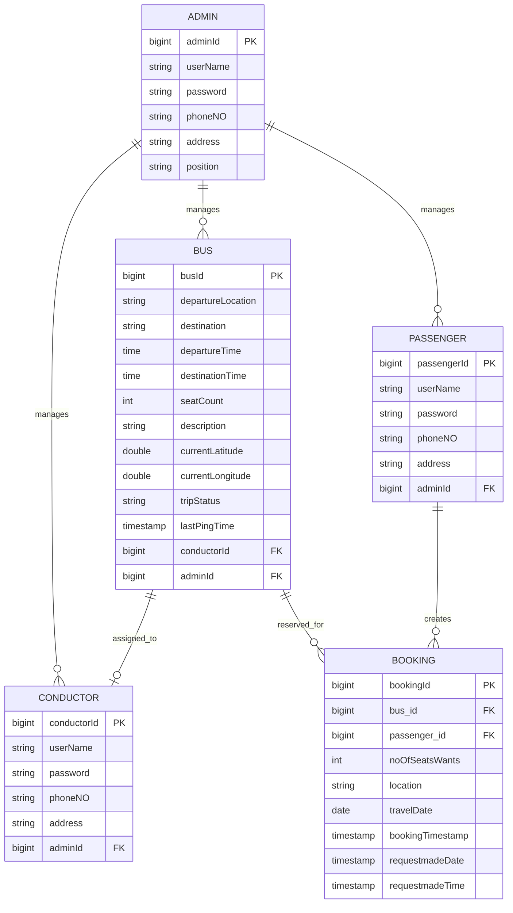

# 🚌 Bus Booking & Real-Time Fleet Tracking System

A full-stack, enterprise-grade Bus Booking, Real-Time GPS Fleet Tracking, and Transit Management ecosystem. The platform seamlessly coordinates bus scheduling, interactive seat reservation, live GPS telemetry, and passenger manifests across **Web (React)** and **Mobile (Flutter)** applications powered by a **Spring Boot** backend.

---

## 📋 Table of Contents
1. [Overview](#-overview)
2. [Ecosystem Architecture](#-ecosystem-architecture)
3. [Technology Stack](#-technology-stack)
4. [Project Structure](#-project-structure)
5. [Core Entities & Database Design](#-core-entities--database-design)
6. [User Roles & Capabilities](#-user-roles--capabilities)
7. [🛰️ Real-Time GPS Bus Tracking System](#-real-time-gps-bus-tracking-system)
8. [📱 Flutter Mobile Application](#-flutter-mobile-application)
9. [Installation & Setup Guide](#-installation--setup-guide)
10. [Configuration & Environment](#-configuration--environment)
11. [Running the Application](#-running-the-application)
12. [Default Credentials](#-default-credentials)
13. [Implementation Roadmap](#-implementation-roadmap)
14. [Related Documentation](#-related-documentation)

---

## 📖 Overview

The **Bus Booking & Fleet Tracking System** is designed to modernize public and private intercity transit by solving scheduling, ticketing, and route visibility challenges for three primary user roles:

- **Passengers:** Search routes, reserve specific seats through an interactive bus seating layout, cancel bookings, view trip history, and **track their booked bus in real time on an interactive map** with live ETAs.
- **Conductors:** View real-time digital passenger manifests, verify boarding details, and **broadcast live GPS coordinates** from their mobile device during active trips.
- **Administrators:** Manage the bus fleet, configure schedules and routes, recruit conductors, oversee passengers, and monitor nationwide fleet operations on a centralized live map.

---


## 🛠️ Technology Stack

### Backend (Core API & Real-Time Broker)
| Technology | Version / Tool | Description |
| :--- | :--- | :--- |
| **Java** | 17 LTS | Core programming language |
| **Spring Boot** | 3.5.6 | Enterprise application framework |
| **Spring Data JPA** | 3.5.6 | ORM and persistence abstraction |
| **Spring WebSocket** | STOMP / SockJS | Bidirectional pub/sub broker for real-time GPS streaming |
| **Hibernate** | 6.x | JPA implementation provider |
| **PostgreSQL Driver** | 42.x | High-performance relational database connectivity |
| **Jakarta Validation**| 3.x | Constraints and validation rules |
| **Lombok** | 1.18.x | Boilerplate code generator |
| **Maven** | 3.x | Dependency and build management |

### Web Frontend (Administration & Desktop Portal)
| Technology | Version / Tool | Description |
| :--- | :--- | :--- |
| **React** | 19.2.0 | Reactive component rendering library |
| **React Router** | 7.9.6 | Client-side routing and navigation |
| **Axios** | 1.13.2 | Promise-based HTTP client |
| **Leaflet / React-Leaflet** | Latest | Open-source interactive map engine |
| **@stomp/stompjs** | Latest | STOMP protocol client over WebSockets |
| **CSS3** | Modular CSS | Responsive styling & interactive seat picker |

### Mobile Application (Flutter Cross-Platform)
| Technology | Package / Tool | Description |
| :--- | :--- | :--- |
| **Flutter SDK** | 3.x / Dart 3.x | Cross-platform framework for Android & iOS |
| **State Management** | flutter_bloc / provider | Reactive architecture and separated business logic |
| **Networking** | dio / http | REST API client with interceptors and token handling |
| **WebSocket** | stomp_dart_client | Real-time STOMP client for tracking topics |
| **Device Geolocation** | geolocator | High-accuracy GPS location tracking for conductors |
| **Mapping Engine** | flutter_map / latlong2 | OpenStreetMap-based mobile map rendering |
| **Local Storage** | flutter_secure_storage | Secure token and session persistence |

---

## 📁 Project Structure

```text
BusBookingSystem/
├── doc/                                 # Architectural & API documentation
│   ├── api-endpoints.md                 # Complete REST endpoint catalog
│   ├── project-arc.md                   # System architectural specifications
│   └── setup.md                         # Detailed environment setup
├── frontend/                            # React 19 Web Application
│   ├── public/
│   │   ├── index.html
│   │   └── manifest.json
│   ├── src/
│   │   ├── assets/                      # Application icons and media
│   │   ├── components/                  # Reusable UI components
│   │   │   ├── BookingCard.jsx          # Visual 50-seat bus layout
│   │   │   ├── BusCard.jsx              # Bus display card with actions
│   │   │   ├── BusFilter.jsx            # Origin/destination route search
│   │   │   ├── LiveBusTracker.jsx       # Interactive Leaflet live tracking map
│   │   │   └── Navbar.jsx               # Role-based navigation bar
│   │   ├── pages/                       # Screen views
│   │   │   ├── AdminDashboard.jsx       # Fleet & workforce management
│   │   │   ├── ConductorDashboard.jsx   # Manifest & GPS broadcasting
│   │   │   ├── Login.jsx                # Multi-role authentication
│   │   │   ├── PassengerDashboard.jsx   # Booking history & live tracking
│   │   │   └── Register.jsx             # Passenger registration
│   │   ├── services/                    # REST API & WebSocket clients
│   │   │   ├── AdminService.js
│   │   │   ├── BookingService.js
│   │   │   ├── BusService.js
│   │   │   ├── ConductorService.js
│   │   │   ├── PassengerService.js
│   │   │   └── WebSocketService.js      # STOMP broker subscription service
│   │   ├── App.css
│   │   ├── App.js
│   │   └── index.js
│   └── package.json
├── mobile_app/                          # Flutter Mobile Application (Cross-Platform)
│   ├── android/                         # Native Android configuration (Permissions, Gradle)
│   ├── ios/                             # Native iOS configuration (Info.plist, Pods)
│   ├── lib/
│   │   ├── core/                        # Constants, themes, network clients, errors
│   │   │   ├── constants/               # API endpoints & route constants
│   │   │   ├── network/                 # Dio client & STOMP client wrapper
│   │   │   └── utils/                   # Coordinate formatters & time helpers
│   │   ├── features/
│   │   │   ├── auth/                    # Login, Register, Session management
│   │   │   ├── booking/                 # Seat layout picker, booking submission
│   │   │   ├── conductor/               # Passenger manifest & GPS broadcast engine
│   │   │   ├── fleet/                   # Route search, bus catalog
│   │   │   └── tracking/                # Live OpenStreetMap tracker with moving markers
│   │   └── main.dart                    # Mobile app entry point
│   └── pubspec.yaml                     # Flutter dependencies & assets
├── src/                                 # Spring Boot Backend Source
│   ├── main/
│   │   ├── java/my/BusBookingSystem/
│   │   │   ├── Config/
│   │   │   │   ├── DBconfig.java        # Database configuration
│   │   │   │   └── WebSocketConfig.java # STOMP broker configuration
│   │   │   ├── Controller/              # REST & WebSocket Controllers
│   │   │   │   ├── AdminController.java
│   │   │   │   ├── BookingController.java
│   │   │   │   ├── BusController.java
│   │   │   │   ├── ConductorController.java
│   │   │   │   ├── LocationController.java # STOMP telemetry broadcast handler
│   │   │   │   └── PassengerController.java
│   │   │   ├── DTO/                     # Data Transfer Objects
│   │   │   │   └── BusLocationDTO.java  # GPS telemetry payload
│   │   │   ├── Entity/                  # JPA Database Entities
│   │   │   │   ├── Admin.java
│   │   │   │   ├── Booking.java
│   │   │   │   ├── Bus.java
│   │   │   │   ├── Conductor.java
│   │   │   │   └── Passenger.java
│   │   │   ├── Repository/              # Spring Data JPA Repositories
│   │   │   ├── Service/                 # Business Logic Services
│   │   │   │   ├── BookingService.java
│   │   │   │   ├── BusService.java
│   │   │   │   ├── ConductorService.java
│   │   │   │   ├── LocationTrackingService.java # In-memory coordinate cache & publisher
│   │   │   │   └── PassengerService.java
│   │   │   ├── BusBookingSystemApplication.java
│   │   │   └── DataSeeder.java          # Super Admin auto-initialization
│   │   └── resources/
│   │       └── application.properties   # Database connection & server config
│   └── test/
├── pom.xml                              # Maven Project Descriptor
├── README.md                            # Comprehensive Project Guide (This document)
└── PROJECT_FUNCTIONS.md                 # Detailed Functional Specification Catalog
```

---

## 🗄️ Core Entities & Database Design



---

## 👥 User Roles & Capabilities

### 1. Passenger (Web & Mobile)
- **Account Management:** User registration with 10-digit phone verification; secure login.
- **Route Search & Schedule Browsing:** Filter buses by origin/destination (Colombo, Kandy, Galle, Matara, Jaffna, etc.).
- **Interactive Seat Reservation:** Visual 50-seat bus layout picker with individual seat status and a 6-seat-per-booking cap.
- **Collision Prevention:** Automated guardrails preventing overlapping bookings while a trip is active.
- **Booking History & Cancellation:** Immediate ticket cancellation with live database updates.
- **Live GPS Tracking:** Follow the booked bus on an interactive map with real-time marker animations and route progress.

### 2. Conductor (Web & Mobile App)
- **Dedicated Authentication:** Secure conductor sign-in.
- **Assigned Trip Manifest:** Access live passenger rosters (names, phone numbers, seat counts).
- **GPS Broadcasting Engine:** One-tap toggle ("Start Trip") that turns the conductor's mobile device into a high-precision GPS beacon broadcasting coordinate packets every few seconds.

### 3. Administrator (Web Portal)
- **Fleet Management:** Create, modify, and retire buses; configure routes and schedules.
- **Workforce Management:** Recruit conductors, inspect rosters, and dynamically assign conductors to buses.
- **Passenger Oversight:** Search, audit, and manage passenger accounts.
- **Central Fleet Map:** Nationwide overview map displaying real-time positions and statuses of all active buses in service.

---

## 🛰️ Real-Time GPS Bus Tracking System

### Telemetry Pipeline
1. **Coordinate Acquisition:**
   - **Mobile Conductor App (Primary):** Background/foreground GPS service using Flutter `geolocator` transmitting `latitude`, `longitude`, `speed`, `heading`, and `timestamp`.
   - **Web Browser Fallback:** HTML5 Geolocation API (`navigator.geolocation.watchPosition`).
   - **Route Simulator (Dev/Demo Mode):** Built-in coordinates playback service simulating transit along predefined waypoints (e.g., A1 Highway: Colombo $\rightarrow$ Kandy).
2. **Backend Brokerage (Spring Boot WebSocket):**
   - Ingestion endpoint: `/app/bus-location`
   - Real-time in-memory cache: Stores latest coordinates without overwhelming the relational database with disk I/O.
   - Pub/Sub distribution: Broadcasts to destination topic `/topic/bus/{busId}` and aggregate fleet topic `/topic/fleet`.
3. **Map Visualization:**
   - Powered by **OpenStreetMap** tiles via **Leaflet** (Web) and **flutter_map** (Mobile) — 100% free with no proprietary API key dependencies or quota billing limits.
   - Smooth marker interpolation prevents jitter between periodic pings.
   - Displays estimated time of arrival (ETA) and route polylines.

---

## 📱 Flutter Mobile Application

The **Flutter Mobile App** provides an on-the-go experience for travelers and bus operators alike:

### Key Features
- **Adaptive Cross-Platform UI:** Native look and feel conforming to Material 3 design on both Android and iOS.
- **Passenger Module:**
  - Interactive seat selection with tactile feedback.
  - Ticket confirmation with digital boarding passes.
  - Interactive live tracking screen centering on the bus with smooth location updates via WebSockets.
- **Conductor Module:**
  - Fast search through the passenger list for boarding verification.
  - Background location broadcasting service enabled with battery-efficient location settings.
  - Offline resilience with network reconnection handling.

---

## ⚙️ Installation & Setup Guide

### Prerequisites
Make sure the following tools are installed:
- **Java Development Kit (JDK):** Version 17+ (`java -version`)
- **Node.js & npm:** Node 18+ and npm 9+ (`node -v`, `npm -v`)
- **Flutter SDK:** Version 3.x+ (`flutter doctor`)
- **PostgreSQL:** Version 12+ (`psql --version`)
- **Git:** Version control (`git --version`)

---

## 🔧 Configuration & Environment

### 1. Database Initialization
Create the PostgreSQL database instance:
```sql
CREATE DATABASE "BusBookingSystemDB";
```

### 2. Backend Properties Configuration
Check `src/main/resources/application.properties` and verify your local database credentials:
```properties
spring.application.name=BusBookingSystem

spring.datasource.url=jdbc:postgresql://localhost:5432/BusBookingSystemDB
spring.datasource.username=postgres
spring.datasource.password=1234
spring.datasource.driver-class-name=org.postgresql.Driver

spring.jpa.hibernate.ddl-auto=update
spring.jpa.show-sql=true
spring.jpa.properties.hibernate.dialect=org.hibernate.dialect.PostgreSQLDialect

server.port=8080
```

---

## 🚀 Running the Application

### 1. Launch Backend Server
From the project root:

**Windows (PowerShell):**
```powershell
.\mvnw.cmd spring-boot:run
```

**Linux / macOS:**
```bash
./mvnw spring-boot:run
```
> The API and WebSocket broker will start on `http://localhost:8080`.

---

### 2. Launch React Web Portal
From the `frontend` folder:
```bash
cd frontend
npm install
npm start
```
> The web application will launch on `http://localhost:3000`.

---

### 3. Launch Flutter Mobile App
From the `mobile_app` directory:
```bash
cd mobile_app
flutter pub get
flutter run
```
> Select an Android emulator, iOS simulator, or connected physical device.

---

## 🔑 Default Credentials

A default Super Administrator account is seeded automatically upon startup (`DataSeeder.java`):

| Role | Username | Password | Creation Method |
| :--- | :--- | :--- | :--- |
| **Admin** | `admin` | `admin123` | Auto-seeded by backend |
| **Conductor** | Created by Admin | Set by Admin | Admin Dashboard $\rightarrow$ Conductor Management |
| **Passenger** | Self-registered | Self-registered | User registration screen (`/register`) |

---

## 🗺️ Implementation Roadmap

| Milestone | Scope | Key Deliverables |
| :--- | :--- | :--- |
| **Milestone 1: Core System** *(Completed)* | Web Portal & Booking API | Multi-role auth, 50-seat reservation engine, fleet management, and manifest viewing. |
| **Milestone 2: Real-Time GPS Backend** | Telemetry Ingestion | `WebSocketConfig`, STOMP message broker, `BusLocationDTO`, in-memory cache, and mock route generator. |
| **Milestone 3: Live Map on Web** | Web Mapping | `react-leaflet` integration, dynamic bus markers, route polyline overlay, and Conductor Web GPS broadcaster. |
| **Milestone 4: Flutter Mobile Client** | Cross-Platform App | Passenger search/booking UI, Conductor manifest, device `geolocator` broadcast service, and mobile live tracking. |
| **Milestone 5: Advanced Transit Features** | Geofencing & Alerts | Arrival notifications, dynamic delay estimates, and exportable trip audit reports. |

---

## 📄 Related Documentation
- **[Functional Specifications Catalog](PROJECT_FUNCTIONS.md)**: Comprehensive reference of business rules, constraints, and validation logic.
- **[REST API Reference](doc/api-endpoints.md)**: Endpoint schemas and request/response payloads.
- **[Architecture Guide](doc/project-arc.md)**: Deep dive into architectural decisions and tier boundaries.
- **[Setup & Deployment Guide](doc/setup.md)**: Extended deployment notes and environment setups.
