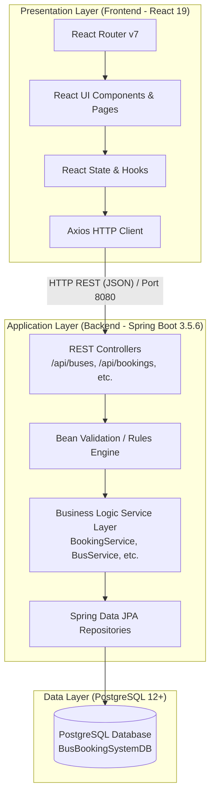
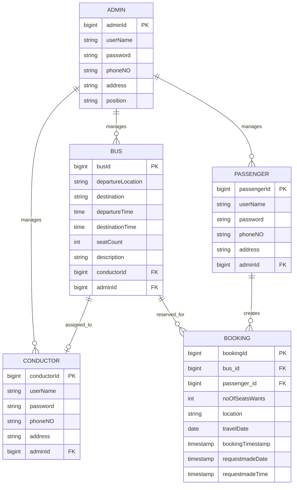

# 🚌 Bus Booking System

A full-stack, enterprise-grade Bus Booking and Fleet Management web application. The platform streamlines bus scheduling, seat reservation, and trip coordination between passengers, bus conductors, and administrators.

---

## 📋 Table of Contents
1. [Overview](#-overview)
2. [System Architecture](#-system-architecture)
3. [Technology Stack](#-technology-stack)
4. [Project Structure](#-project-structure)
5. [Core Entities & Database Design](#-core-entities--database-design)
6. [User Roles & Key Capabilities](#-user-roles--key-capabilities)
7. [Installation & Setup Guide](#-installation--setup-guide)
8. [Configuration & Environment](#-configuration--environment)
9. [Running the Application](#-running-the-application)
10. [Default Credentials](#-default-credentials)
11. [Related Documentation](#-related-documentation)

---

## 📖 Overview

The **Bus Booking System** is designed to solve real-world intercity transit challenges by providing a synchronized platform for three primary stakeholders:
- **Passengers:** Search bus routes, select seats through an interactive bus seating chart, book tickets, and manage travel itineraries.
- **Conductors:** View live passenger manifests for their assigned buses, monitor passenger seat allocations, and verify passenger contact details.
- **Administrators:** Manage the bus fleet, configure travel schedules, hire and assign conductors, and oversee passenger accounts.

---

## 🏗️ System Architecture

The application adopts a **3-Tier Client-Server Architecture** with strict separation of concerns:



### Architectural Highlights:
- **Presentation Layer (React 19):** Single Page Application (SPA) driven by React Router v7 and styled with CSS3. Communicates asynchronously with the backend via Axios REST calls.
- **Business Logic Layer (Spring Boot 3.5.6):** Implements modular controllers and services. Handles constraint checks (e.g., active booking collision prevention, strict 10-digit phone verification, date validity).
- **Persistence Layer (Spring Data JPA / Hibernate):** Object-Relational Mapping (ORM) mapping Java domain entities to PostgreSQL tables with relationship cascading and foreign key integrity.

---

## 🛠️ Technology Stack

### Backend
| Technology | Version | Description |
| :--- | :--- | :--- |
| **Java** | 17 | Core programming language |
| **Spring Boot** | 3.5.6 | Application framework |
| **Spring Data JPA** | 3.5.6 | Object-Relational Mapping and database abstraction |
| **Hibernate** | 6.x | JPA implementation provider |
| **Spring Validation** | Jakarta Validation | Input validation and constraints |
| **Lombok** | 1.18.x | Boilerplate code reduction |
| **PostgreSQL Driver** | 42.x | JDBC driver for PostgreSQL |
| **Maven** | 3.x | Build and dependency management |

### Frontend
| Technology | Version | Description |
| :--- | :--- | :--- |
| **React** | 19.2.0 | UI rendering library |
| **React DOM** | 19.2.0 | DOM renderer for React |
| **React Router DOM** | 7.9.6 | Client-side routing and page navigation |
| **Axios** | 1.13.2 | Promise-based HTTP client |
| **CSS3** | — | Custom responsive UI styling & seating layout |

### Database & Infrastructure
| Technology | Description |
| :--- | :--- |
| **PostgreSQL** | Relational Database Management System (RDBMS) |
| **CORS** | Cross-Origin Resource Sharing configured for `http://localhost:3000` |

---

## 📁 Project Structure

```text
BusBookingSystem/
├── doc/                                 # Architectural & API documentation
│   ├── api-endpoints.md
│   ├── project-arc.md
│   └── setup.md
├── frontend/                            # React Frontend SPA
│   ├── public/
│   │   ├── index.html
│   │   └── manifest.json
│   ├── src/
│   │   ├── assets/                      # Application images & icons
│   │   ├── components/                  # Reusable UI components
│   │   │   ├── BookingCard.jsx          # Interactive 50-seat bus visual layout
│   │   │   ├── BusCard.jsx              # Bus display card with role-specific actions
│   │   │   ├── BusFilter.jsx            # Departure/Destination route search filter
│   │   │   └── Navbar.jsx               # Navigation bar with role and logout
│   │   ├── pages/                       # Screen views
│   │   │   ├── AdminDashboard.jsx       # Admin management (Buses, Conductors, Passengers)
│   │   │   ├── ConductorDashboard.jsx   # Conductor passenger list view
│   │   │   ├── Login.jsx                # Multi-role authentication page
│   │   │   ├── PassengerDashboard.jsx   # Passenger booking & history dashboard
│   │   │   └── Register.jsx             # Passenger account registration
│   │   ├── services/                    # Axios API integration modules
│   │   │   ├── AdminService.js
│   │   │   ├── BookingService.js
│   │   │   ├── BusService.js
│   │   │   ├── ConductorService.js
│   │   │   └── PassengerService.js
│   │   ├── App.css                      # Global and component styles
│   │   ├── App.js                       # App component & client route table
│   │   └── index.js                     # React DOM entry point
│   ├── package.json
│   └── README.md
├── src/                                 # Spring Boot Backend Source
│   ├── main/
│   │   ├── java/my/busbookingsystem/
│   │   │   ├── Config/
│   │   │   │   └── DBconfig.java        # Database configuration
│   │   │   ├── Controller/              # REST API Controllers
│   │   │   │   ├── AdminController.java
│   │   │   │   ├── BookingController.java
│   │   │   │   ├── BusController.java
│   │   │   │   ├── ConductorController.java
│   │   │   │   └── PassengerController.java
│   │   │   ├── Entity/                  # JPA Database Entities
│   │   │   │   ├── Admin.java
│   │   │   │   ├── Booking.java
│   │   │   │   ├── Bus.java
│   │   │   │   ├── Conductor.java
│   │   │   │   └── Passenger.java
│   │   │   ├── Repository/              # Spring Data Repositories
│   │   │   │   ├── AdminRepository.java
│   │   │   │   ├── BookingRepository.java
│   │   │   │   ├── BusRepository.java
│   │   │   │   ├── ConductorRepository.java
│   │   │   │   └── PassengerRepository.java
│   │   │   ├── Service/                 # Business Logic Layer
│   │   │   │   ├── BookingService.java
│   │   │   │   ├── BusService.java
│   │   │   │   ├── ConductorService.java
│   │   │   │   └── PassengerService.java
│   │   │   ├── BusBookingSystemApplication.java # Spring Boot Entry Point
│   │   │   └── DataSeeder.java          # Automatic DB seed for Super Admin
│   │   └── resources/
│   │       ├── application.properties   # Database credentials & server config
│   │       ├── static/
│   │       └── templates/
│   └── test/                            # Backend Unit & Integration Tests
├── pom.xml                              # Maven Project Descriptor
├── mvnw & mvnw.cmd                      # Maven Wrapper scripts
├── README.md                            # Project Readme (This document)
└── PROJECT_FUNCTIONS.md                 # Detailed Functional Specification Report
```

---

## 🗄️ Core Entities & Database Design



---

## 👥 User Roles & Key Capabilities

### 1. Passenger
- **Registration & Login:** Self-registration with 10-digit phone verification; login authentication.
- **Route Search & Filtering:** Filter buses by origin and destination cities (e.g., Colombo, Kandy, Galle, Matara, etc.).
- **Interactive Seat Reservation:** Visual 50-seat bus layout with interactive selection (1 to 6 seats per booking).
- **Date Picker & Conflict Check:** Select upcoming travel dates. System prevents booking duplicate trips if an active booking is already running.
- **Booking Management:** Review active & past booking history; cancel active reservations in real-time.

### 2. Conductor
- **Dedicated Authentication:** Secure login for bus operators.
- **Assigned Bus Manifest:** Automatically retrieves trip reservations for their assigned bus.
- **Passenger List:** View passenger names, contact numbers, and booked seat counts for on-board verification.

### 3. Administrator
- **Fleet Management:** Add new buses with schedules, seat capacities, and route details; update existing buses; delete retired buses.
- **Conductor Workforce Management:** Hire new conductors; search conductor records; assign or unassign available conductors to buses.
- **Passenger Administration:** View all registered passengers and manage accounts.
- **Super Admin Auto-Seeding:** Automatic initialization of default administrator credentials on startup.

---

## ⚙️ Installation & Setup Guide

### Prerequisites
Make sure you have the following installed on your machine:
- **Java Development Kit (JDK):** Version 17 or later (`java -version`)
- **Node.js & npm:** Node 18+ and npm 9+ (`node -v`, `npm -v`)
- **PostgreSQL:** Version 12 or later (`psql --version`)
- **Git:** Version control (`git --version`)

---

## 🔧 Configuration & Environment

### 1. Database Creation
Launch PostgreSQL via `psql` or pgAdmin and create the database:
```sql
CREATE DATABASE "BusBookingSystemDB";
```

### 2. Configure Backend Database Connection
Open `src/main/resources/application.properties` and verify your credentials:
```properties
spring.application.name=BusBookingSystem

spring.datasource.url=jdbc:postgresql://localhost:5432/BusBookingSystemDB
spring.datasource.username=postgres
spring.datasource.password=1234
spring.datasource.driver-class-name=org.postgresql.Driver

spring.jpa.hibernate.ddl-auto=update
spring.jpa.show-sql=true
spring.jpa.properties.hibernate.dialect=org.hibernate.dialect.PostgreSQLDialect

server.port=8080
```

---

## 🚀 Running the Application

### 1. Start Backend Service
From the project root directory:

**On Windows:**
```powershell
.\mvnw.cmd spring-boot:run
```

**On Linux/macOS:**
```bash
./mvnw spring-boot:run
```
> The backend server will start on `http://localhost:8080`.

### 2. Start Frontend Application
Open a new terminal window, navigate to the `frontend` folder, and run:
```bash
cd frontend
npm install
npm start
```
> The React development server will start on `http://localhost:3000` and automatically open in your browser.

---

## 🔑 Default Credentials

The application automatically seeds a default Super Administrator account when the database table is empty (`DataSeeder.java`):

| Role | Username | Password | Notes |
| :--- | :--- | :--- | :--- |
| **Admin** | `admin` | `admin123` | Pre-configured Super Admin account |
| **Conductor** | Created by Admin | Set by Admin | Can be hired via Admin Dashboard |
| **Passenger** | Self-registered | Self-registered | Can be created via `/register` |

---

## 📄 Related Documentation
- **[Detailed Project Functions Report](PROJECT_FUNCTIONS.md)**: Exhaustive catalog of system functions, business rules, and API specifications.
- **[API Reference](doc/api-endpoints.md)**: Quick REST API endpoint list.
- **[Project Architecture](doc/project-arc.md)**: High-level architectural notes.
- **[Setup Guide](doc/setup.md)**: Setup and deployment notes.
